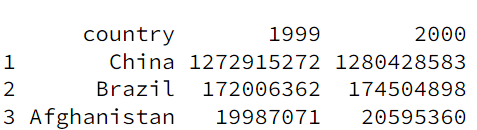
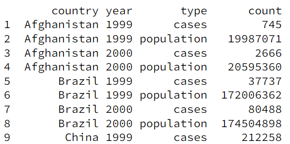
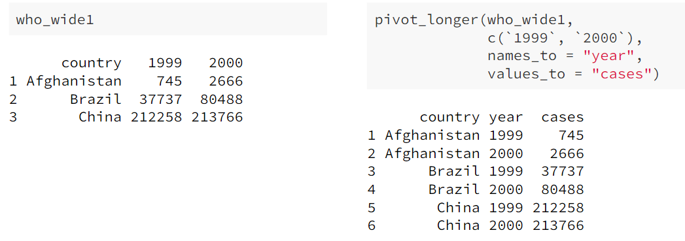
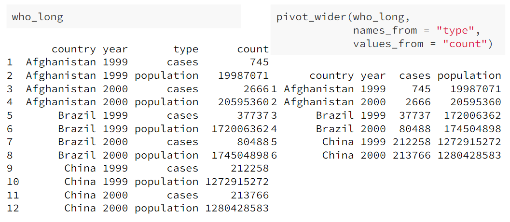
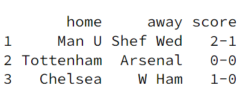
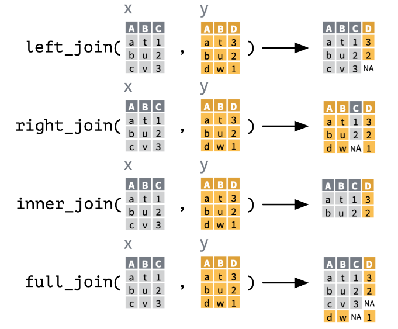

## Accessing and Defining Vectors

- Using R, there are numerous different ways of defining a vector...

```r
rep(3, 4) # 3 3 3 3

4:7 # 4 5 6 7

seq(4,7) # 4 5 6 7

seq(0, 10, by=2) # 0 2 4 6 8 10

seq(0, 3, length.out=7) # 0.0 0.5 1.0 1.5 2.0 2.5 3.0
```

- In addition, there are different ways to access vectors using

```r
myData # 2 3 5 8

myData[2] # 3

myData[-3] # 2 3 8

myData[c(1,4)] # 2 8

myData[2:4] # 3 5 8
```

## Some essential built-in functions

- Whenever you want to learn more about a method/function in R you can type `?[methodName]` in the console.

```r
sort

rank # rank of each element

order # indices of elements in order

unique # removes duplicates

table # counts of each element's occurrences

length

sample # randomly sample elements from vector

paste # concatenate a textual representation of vectors together
```

_Simulate throwing a dice 200 times and get counts of the total number of each face_

```r
table(sample(1:6, 200, replace = TRUE))
# eg.  1  2  3  4  5  6
#      38 26 35 37 27 37
```

_Bootstrap resampling a vector_

```r
x <- 1:100

y <- sample(x, replace=TRUE)
```

## Data frames

- Data frames allow us to represent a _design matrix_; so a `data.frame` in R is essentially a _design matrix_.

* _We can create a data frame manually in R_

```r
X <- data.frame(Height = c(147, 150, 152),
                Weight = c(52.2, 53.1, 54.4))
```

_Note: These will usually be done via a `.csv` file instaed_

### Accessing data frames


- Here are some equivalent ways of accessing data frames in R

```r
hw$Height
hw[,1] # first column

hw[3,] # third row

hw[hw$Weight > 50] # filtered (but better ways to do this later)
hw[sample(1:nrow(hw), 4),] # random selection of columns
```

- We can also use factors when accessing data frames

```r
chickwts[chickwts$feed %in% c("sunflower","linseed"), ]
```

- Workflow in R...


### Useful functions when working with data frames

```r
names(hw) # list of the data frame variables

dim(hw) # dimension of the data frame

nrow(hw) # no. of rows
ncol(hw)

head(hw) # get first 6 entries

summary(hw) # key information

str(hw) # convert to string
```

- other useful self-explanatory functions: `colMeans, rowMeans, colSums, rowSums, cov, cor, scale, ...`

* We can also add new variables to a data frame by using the accessor notation then just adding a new one that doesn't already exist in the data frame:

```r
hw$BMI3D = 1.3*hw$Weight/(hw$Height/100)^2.5
```

### Omitting missing data

- In R, there are two ways to remove `NA` values from a data set

```r
mean(chickwts$weight, na.rm = TRUE) # 1

mean(na.omit(chickwts$weight)) # 2
```

### Lists in R

- In R, lists can hold multiple different data types

```r
x <- list(1, "a", c(1,2,3), data.frame(a = 1:3, b = 4:6))
```

### Plotting in R

- Using the default `plot` function we can achieve a lot in R...

```r
data("diamonds", package = "ggplot2")

plot(diamonds$carat, diamonds$price)

plot(diamonds$carat, diamonds$price, pch = 20)

plot(diamonds$carat, diamonds$price,
     pch = 20, xlim = c(0,1), ylim = c(0,10000))

plot(diamonds$carat, diamonds$price, pch = 20,
     main = "Dollar price against carat",
     xlab = "Carats", ylab = "Price in $")

abline(lm(price ~ carat, diamonds),
       col = "red")

lines(lowess(diamonds$carat, diamonds$price, f = 0.05),
      col = "green")

pairs(mtcars) # grid of all pairwise scatter plots
```

#### Creating multiple plots on the same area

In R, we can create multiple plots on the same figure by using the `par` command.

```r
# divides into 2 plot areas
par(mfrow = c(2,1))
plot(movies$length, movies$budget)
boxplot(movies$length)
par(mfrow = c(1,1))
```

### Tidy data in R

- We can use `Tidyverse` in R which allows us to create "tidy" data.
- Data is in "tidy" form when
  - each variable is in a column
  - each observation is in a row
  - each type of observation unit forms a table
- When data is "tidy" it is easier to to further manipulation with

#### Wide vs Long Data

- If data is too "wide", one variable is actually spread over multiple columns



- If data is too "long", one observation is actually spread over multiple rows



We have two key functions for dealing with these problems: `pivot_longer` and `pivot_wider`.

#### `pivot_longer`

- Gathers multiple columns into key-value pairs, essentially makes wide data longer



#### `pivot_wider`

- Gather multiple rows into key-value pairs, makes long data wider



### Useful tidyr functions



```r
separate(fball, "score", c("home_goals", "away_goals"))
```

- This function allows us to separate the "score" column into two separate columns (one for home goals and the other for away goals)

### Data manipulation (dplyr)

- There are several main very important functions in the `dplyr` library

1. `filter()` => separate conditions via `&` and `|`

```r
filter(fball, home == "Chelsea" | away == "Chelsea")
```

2. `arrange()` => reorder rows

```r
arrange(who, year, desc(country))
```

- We can use the `desc()` parameter to sort in descending order

```r
flights |>
  filter(is.na(dep_time)) |>
  mutate(sched_dep_time = floor(sched_dep_time/100)) |>
  group_by(sched_dep_time) |>
  summarise(cancelled = n()) |>
  arrange(desc(cancelled))
```

### Joining data frames



- Note: we could also use `rbind()` and `cbind()` to perform similar tasks but these are often error prone, so it is generally better to use the methods above when possible.

```r
rbind(who_cases, who_population)
```

### Advanced plotting in R (ggplot)

- We use the `ggplot()` function in R to do any plot, where we have the arguments `data` and `mappings`
  - mappings are always specified by a call to `aes()`

```r
data("diamonds", package = "ggplot2")

ggplot(diamonds, aes(x = carat, y = price))
```

This is good, but we haven't specified what plot to do, only the data has been given. Hence, we need to use "Geoms" to specify this.

```r
ggplot(diamonds, aes(x = carat, y = price)) +
  geom_point()
```

- Geoms inherit the `data` and `mapping` from the original plot, and each geom will build up layers in the order that you call them.

```r
ggplot(diamonds, aes(x = carat, y = price)) +
  geom_point(aes(colour = cut))
```

_The above figure adds colour to the plot; the cuts are colour coded_

- We can combine multiple geoms together

```r
ggplot(diamonds, aes(x = carat, y = price)) +
  geom_point(aes(colour = cut), size = 0.2) +
  geom_smooth()
```

_Note: `geom_smooth` adds a smoothing line, so we can more easily see any trends in the data._

```r
ggplot(diamonds, aes(x = carat, y = price)) +
  geom_point(aes(colour = cut), size = 0.2) +
  geom_smooth(aes(colour = cut)) +
  xlab("Number of carats") + ylab("Price in $")
```

- Some more examples...

```r
ggplot(diamonds, aes(x = carat, y = price)) +
  geom_hex()

ggplot(diamonds, aes(x = cut, y = carat)) +
  geom_boxplot()
```

#### Faceting

- Faceting enables splitting the data into multiple plots according to a categorical variable
  - `facet_wrap` - splits a single variable ( ~ var )
  - `facet_grid` - two variable split ( rows_var ~ cols_var )

```r
# 1. facet_wrap
ggplot(mtcars, aes(x = hp, y = mpg)) +
  facet_wrap(~ gear) +
  geom_point()

# 2. facet_grid
ggplot(mtcars, aes(x = hp, y = mpg)) +
  facet_grid(cyl ~ gear) +
  geom_point()
```

### Date and Time in R

#### Constructing dates/date-times

```r
today() # "2022-02-26"

now() # "2022-02-26 20:01:49 GMT"
```

_See also: `ymd_hms`, `make_datetime` etc._

#### Extracting from dates/date-times

We can get the individual components of a date-time...

```r
datetime <- ymd_hms("2021-12-02 12:33:59")

year(datetime) # 2021

month(datetime) # 12

mday(datetime) # 2

yday(datetime) # 336

wday(datetime) # 5

# ...
```

#### Durations

- In R, we can perform a variety of actions with dates, for example basic operations such as subtraction and addition

```r
einstein <- dmy("14th March 1879")
age <- today() - einstein
```

### Strings in R

- A string (as in any programming context) is defined as a sequence of characters shown below

```r
s <- "Hello World!"
```

There are many methods for working with strings

```r
z <- c("Alice", "Bob", "Connie", "David")
str_sub(z, 1, 4) # Alic Bob Conn Davi
```

_See also: `str_trim`, `str_squish`_

- Using the `str_view` method in R, we can view how a particular [Regex](https://en.wikipedia.org/wiki/Regular_expression) will be evaluated

```r
y <- c("There were 122 in total", "Overall about 390 found", "100 but no more")
str_view(y, "[0-9]+")
```

- There are also many more methods for working with regular expressions, which are available in the [Documentation for R](https://www.rdocumentation.org/).
