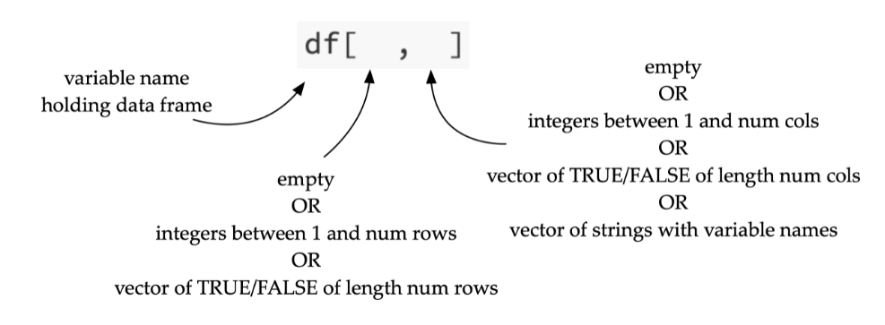
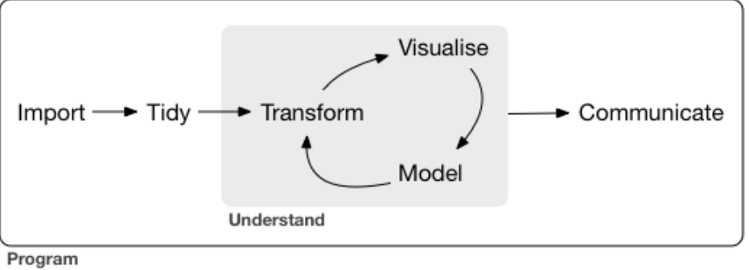

## Accessing and Defining Vectors

- Using R, there are numerous different ways of defining a vector...

```r
rep(3, 4) # 3 3 3 3

4:7 # 4 5 6 7

seq(4,7) # 4 5 6 7

seq(0, 10, by=2) # 0 2 4 6 8 10

seq(0, 3, length.out=7) # 0.0 0.5 1.0 1.5 2.0 2.5 3.0
```

- In addition, there are different ways to access vectors using

```r
myData # 2 3 5 8

myData[2] # 3

myData[-3] # 2 3 8

myData[c(1,4)] # 2 8

myData[2:4] # 3 5 8
```

## Some essential built-in functions

- Whenever you want to learn more about a method/function in R you can type `?[methodName]` in the console.

```r
sort

rank # rank of each element

order # indices of elements in order

unique # removes duplicates

table # counts of each element's occurrences

length

sample # randomly sample elements from vector

paste # concatenate a textual representation of vectors together
```

_Simulate throwing a dice 200 times and get counts of the total number of each face_

```r
table(sample(1:6, 200, replace = TRUE))
# eg.  1  2  3  4  5  6
#      38 26 35 37 27 37
```

_Bootstrap resampling a vector_

```r
x <- 1:100

y <- sample(x, replace=TRUE)
```

## Data frames

- Data frames allow us to represent a _design matrix_; so a `data.frame` in R is essentially a _design matrix_.

* _We can create a data frame manually in R_

```r
X <- data.frame(Height = c(147, 150, 152),
                Weight = c(52.2, 53.1, 54.4))
```

_Note: These will usually be done via a `.csv` file instaed_

### Accessing data frames



- Here are some equivalent ways of accessing data frames in R

```r
hw$Height
hw[,1] # first column

hw[3,] # third row

hw[hw$Weight > 50] # filtered (but better ways to do this later)
hw[sample(1:nrow(hw), 4),] # random selection of columns
```

- We can also use factors when accessing data frames

```r
chickwts[chickwts$feed %in% c("sunflower","linseed"), ]
```

- Workflow in R...



### Useful functions when working with data frames

```r
names(hw) # list of the data frame variables

dim(hw) # dimension of the data frame

nrow(hw) # no. of rows
ncol(hw)

head(hw) # get first 6 entries

summary(hw) # key information

str(hw) # convert to string
```

- other useful self-explanatory functions: `colMeans, rowMeans, colSums, rowSums, cov, cor, scale, ...`

* We can also add new variables to a data frame by using the accessor notation then just adding a new one that doesn't already exist in the data frame:

```r
hw$BMI3D = 1.3*hw$Weight/(hw$Height/100)^2.5
```

### Omitting missing data

- In R, there are two ways to remove `NA` values from a data set

```r
mean(chickwts$weight, na.rm = TRUE) # 1

mean(na.omit(chickwts$weight)) # 2
```

### Lists in R

- In R, lists can hold multiple different data types

```r
x <- list(1, "a", c(1,2,3), data.frame(a = 1:3, b = 4:6))
```

### Plotting in R

- Using the default `plot` function we can achieve a lot in R...

```r
data("diamonds", package = "ggplot2")

plot(diamonds$carat, diamonds$price)

plot(diamonds$carat, diamonds$price, pch = 20)

plot(diamonds$carat, diamonds$price,
     pch = 20, xlim = c(0,1), ylim = c(0,10000))

plot(diamonds$carat, diamonds$price, pch = 20,
     main = "Dollar price against carat",
     xlab = "Carats", ylab = "Price in $")

abline(lm(price ~ carat, diamonds),
       col = "red")

lines(lowess(diamonds$carat, diamonds$price, f = 0.05),
      col = "green")

pairs(mtcars) # grid of all pairwise scatter plots
```
