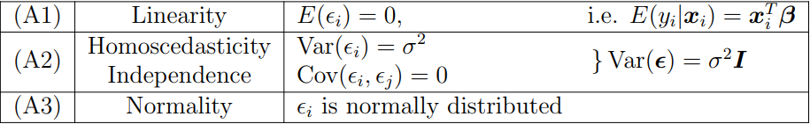

## Understanding the model

If we have the data $Z$, we can formulate a linear model with:

$$Y = X\beta+\epsilon$$

- $Y$ = vector of responses
- $X$ = design matrix
- $\beta$ = parameter vector
- $\epsilon$ = vector of errors

## Modelling Assumptions

- Any model that adheres to at least A1 and A2 is considered a linear model



## Estimating model parameters

### 1. Least-Squares (LS) estimation of $\beta$

Given $\beta = (\hat\beta_1, ..., \hat\beta_p)^T$, we want to minimize $R(\beta) = (Y - X\beta)^T(Y - X\beta)$.

- From this, we obtain $\hat\beta = (X^TX)^{-1}X^TY$ which shows that each $\hat\beta_j$ is a known linear combination of the $y_i$ responses.

Note that $X^TX$ has the following properties:

- _Symmetric_: $(X^TX)^T = X^TX$
- _Positive semi-definite_: (look online) - _when a matrix is positive semi-definite, its eigenvalues are all non-negative_.

Notice that these properties correspond to the same properties of a valid variance matrix.

### 2. Estimation of $\sigma^2$

First, note that:

$E[{\epsilon_i}^2] = \sigma^2 = E[\frac{\epsilon^T\epsilon}{n}]$

Then we can form a "bias-corrected" estimate of $\sigma^2$, based on the known residuals $\hat\epsilon_i$:

$$
s^2 = \frac{RSS}{n-p}
$$

where $RSS$ denotes $R(\hat\beta)$ and is called the _"Residual Sum of Squares"_ with $n-p$ degrees-of-freedom.

## Properties of $\hat\beta$ and $s^2$

### 1. $\hat\beta$

- $\hat\beta$ is an _unbiased_ estimator

$$
E[\hat\beta] = E[(X^TX)^{-1}X^TY] = (X^TX)^{-1}X^TE[Y] = (X^TX)^{-1}X^TX\beta = \beta
$$

- under the variance assumption (A2), we get

$$
Var[\hat\beta] = ... = (X^TX)^{-1}\sigma^2
$$

- we can also calcalate these results with linear combinations

$$
Var[c^T\hat\beta] = \sigma^2c^T(X^TX)^{-1}c
$$

- and for the _standard error_ (SE) of $\hat\beta_j$, the estimate of $SD[\hat\beta_j]$

$$
SE[\hat\beta_j] = s\sqrt{[(X^TX)^{-1}]_{jj}}
$$

### 2. $s^2$

- our variance is...

$$
Var[\hat\epsilon] = E[{\hat\epsilon}{\hat\epsilon}^T]
$$

- and our expectation...

$$
E[s^2] = \frac{{\hat\epsilon}^T\hat\epsilon}{n-p} = \sigma^2
$$

## Application to R

### 1. Creating a linear model

```r
y <- stack.loss # define response variable
# define predictors
x1 <- stackloss$Air.Flow
x2 <- stackloss$Water.Temp
x3 <- stackloss$Acid.Conc.

# create linear model
fit <- lm(y ~ x1+x2+x3)
# get key information on our linear model
summary(fit)
```

Now we can make predictions using our model via the `predict` function in R:

```r
# predict stack loss from our 3 predictors at a given value
predict(fit, data.frame(x1=50, x2=21, x3=85), interval="confidence")
```

We can also obtain other useful results from our linear model

```r
coeffs <- fit$coefficients # LEAST SQUARES ESTIMATES OF INTERCEPT AND SLOPE

fit$residuals              # RESIDUALS FROM FITTED MODEL

fit$fitted.values          # FITTED VALUES

X <- model.matrix(fit)     # DESIGN MATRIX
```

Further more, we can obtain the residual sum of squares (RSS), its degrees of freedom and the residual standard error $s$:

```r
RSS <- sum(cement.lm$residuals^2) # RESIDUAL SUM OF SQUARES
df <- cement.lm$df                # DEGREES OF FREEDOM
s <- sqrt(RSS/df)                 # ESTIMATE OF SIGMA
```

- Note: this is an estimate of _sigma_ as shown above in the section for estimating $\sigma^2$, where $n-p$ is the degrees-of-freedom.
